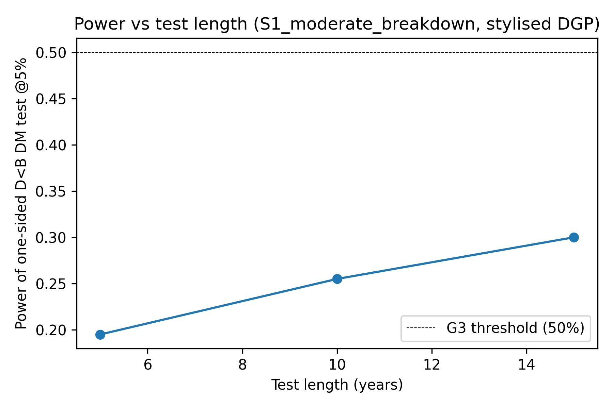
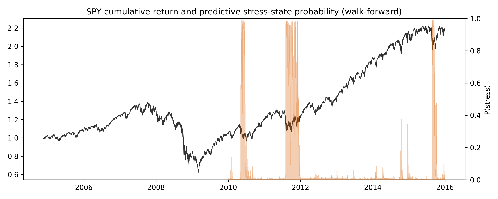
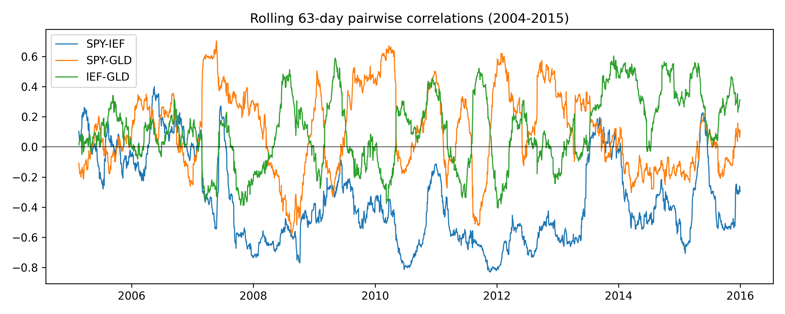
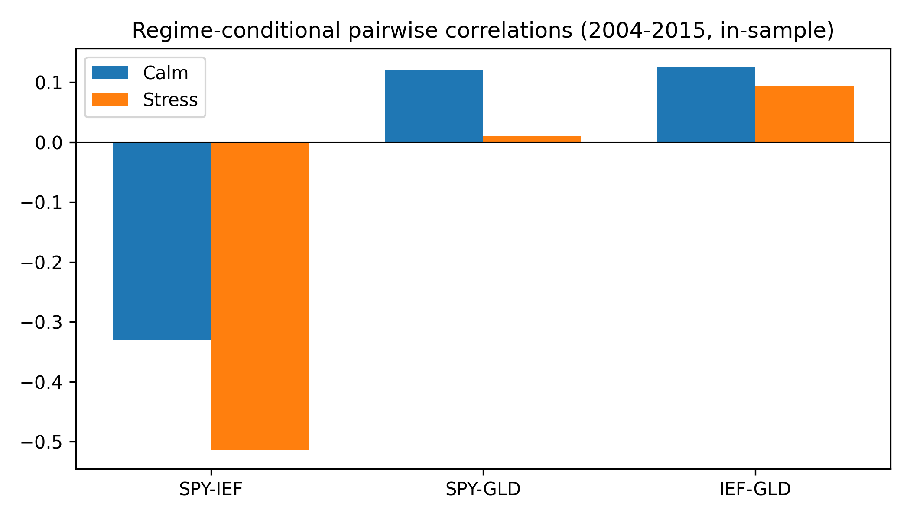
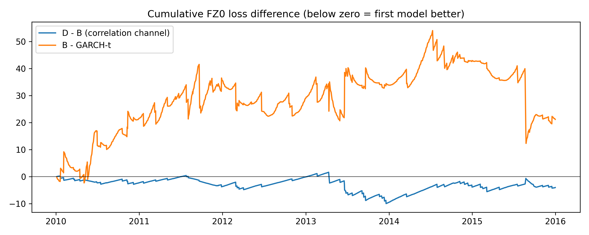
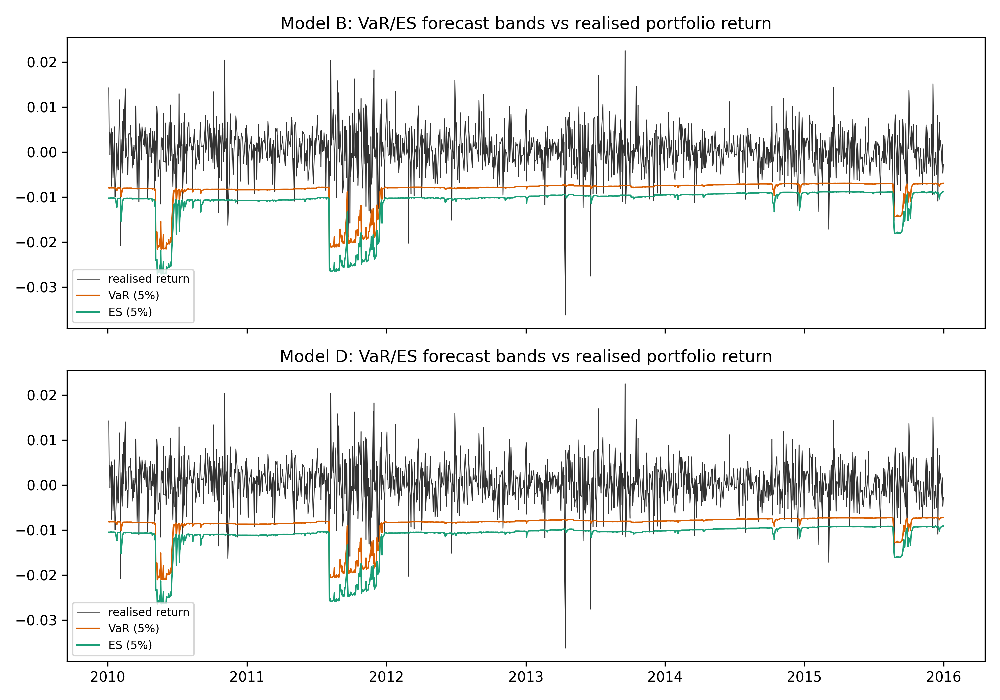

# Pilot Study Report

**Regime-Switching Risk Models for ETF Portfolios — Pilot**
Prepared for Prof. Seo. All numbers below are read programmatically from
`output/tables/*.json`; see `scripts/generate_pilot_report.py`.

## 1. Question and why a pilot

For a fixed equal-weight SPY/IEF/GLD portfolio, does letting cross-asset
*correlations* change by regime improve one-day-ahead VaR/Expected
Shortfall forecasts beyond letting only *volatilities* change? A pilot was
run first because the correlation channel is the harder, more novel half
of the design (Section 6 of `docs/literature_briefing.md` shows the
published evidence on this is genuinely split), and because the full
5-week thesis timeline does not survive discovering a feasibility,
power, or reproducibility problem in week 3 instead of week 1.

## 2. What was run

Five work packages: WP0 (data acquisition and audit of SPY/IEF/GLD,
2010-2025), WP1 (a 41-test correctness suite for the model engine), WP2
(a Monte Carlo power study — can this design detect a correlation-regime
effect at all, given ~10 years of daily data?), WP3 (a real-data pilot on
the locked-safe 2010-2015 window: descriptive regime statistics,
walk-forward backtest, stability diagnostics, named-episode diagnostics),
and WP4 (a single-machine reproducibility check).

| Component | Setting |
|---|---|
| Universe (pilot) | SPY, IEF, GLD, equal-weight, no rebalancing |
| Regime model | 2-state Gaussian HMM on SPY returns only, filtered/one-step-predictive probabilities |
| Covariance variants | A (no regime), B (regime vol, pooled corr), C (pooled vol, regime corr), D (regime vol + corr) |
| Benchmarks | Historical simulation (500d), EWMA (lambda=0.94), multivariate EWMA, GARCH(1,1)-t |
| Estimation window / refit | 1260 trading days, refit every 21 days (GARCH every 63) |
| Alpha levels | 5% (primary), 2.5% (secondary) |
| Scoring | FZ0 joint VaR/ES loss, Diebold-Mariano with Newey-West HAC errors |
| WP2 simulation scenarios | S0 vol-only (null), S1 moderate breakdown, S2 strong breakdown, S3 flight-to-quality; stylised + real-data-calibrated DGP; 200 reps @5%, 100 reps @2.5% each |

## 3. Results

### 3a. Correctness (WP1)

`41 passed, 80 warnings in 1.86s` — all tests pass, covering the mixture VaR/ES root-finding,
the zero-mean fix, HMM warm-starting, the no-look-ahead invariant, and the
EWMA/EWMA_MV algebraic-equivalence property (see `docs/decisions_log.md`).

### 3b. Simulation power (WP2)

D<B one-sided Diebold-Mariano test, rejection rate at nominal alpha=0.05,
n=200 replications/cell:

| Scenario | Stylised DGP power | Calibrated DGP power |
|---|---|---|
| S0 vol-only (null / false-positive rate) | 5.0% | 2.0% |
| S1 moderate breakdown | 25.5% | 16.5% |
| S2 strong breakdown | 52.5% | 42.0% |
| S3 flight-to-quality | 3.5% | 9.5% |

Power vs. test-length (stylised DGP, S1 moderate breakdown, alpha=0.05):

| Years of daily data | 5 | 10 | 15 |
|---|---|---|---|
| D<B power | 19.5% | 25.5% | 30.0% |

Total WP2 runtime: 40.3 minutes
(2417s), 2,800 replications, on this machine
(see Section 6 for machine specs).

### 3c. Real-data pilot, 2010-2015 (WP3)

Descriptive: full-sample (2004-2015) stress-regime share
18.3%, expected calm duration
144.7 days, expected stress
duration 32.4 days.
Shapley attribution of the calm-to-stress portfolio-vol increase:
volatility channel 113.1%,
correlation channel -13.1%
(negative — see Section 5). Equity-bond correlation moves from
-0.33 (calm) to -0.51 (stress): *more* negative,
i.e. more hedging, not a breakdown, in this sample.

Walk-forward backtest, alpha=5%:

| Model | FZ0 loss | Hit rate | Kupiec p | Christoffersen p |
|---|---|---|---|---|
| A | -4.4058 | 3.05% | 0.0002 | 0.0133 |
| B | -4.4397 | 4.24% | 0.1637 | 0.4439 |
| C | -4.3840 | 2.65% | 0.0000 | 0.0036 |
| D | -4.4423 | 3.91% | 0.0431 | 0.6488 |
| HS | -4.4129 | 4.11% | 0.1004 | 0.0148 |
| EWMA | -4.4245 | 5.10% | 0.8599 | 0.1369 |
| EWMA_MV | -4.4245 | 5.10% | 0.8599 | 0.1369 |
| GARCHt | -4.4537 | 5.89% | 0.1206 | 0.1100 |

Primary contrast D-B: DM t=-0.469, p=0.639 —
not significant on this window. B-GARCHt: t=0.436,
p=0.663; D-GARCHt: t=0.358,
p=0.720 — neither regime variant significantly beats
GARCH-t on this window either.

### 3d. Stability (WP3)

72 monthly refits over 2010-2015. 0/72 collapsed
refits, 0/72 large stress-share jumps between refits (no
label flips). Expected stress duration per refit ranges
44.6-96.8 days (floor: 5 days). Stress share
in-window: mean 17.6%, range [7.7%, 24.2%].
Joint criterion (duration >=5d AND stress share in [10%,40%] AND no flip):
met in 65/72 refits (90.3%).

### 3e. Reproducibility (WP4)

WP1 rerun: all passed = `True`. WP3 rerun: numerically identical to
committed tables = `True`. WP2 checkpoint-subset recomputation:
0 mismatches (bit-identical, rtol 1e-8). WP2 under a
different master seed (reduced batch, n=50/scenario): same qualitative
ranking across scenarios, within the pre-declared wide tolerance for all
4 scenarios (main vs. alt-seed power:
S0_vol_only: 5.0% vs 4.0%, S1_moderate_breakdown: 25.5% vs 22.0%, S2_strong_breakdown: 52.5% vs 52.0%, S3_flight_to_quality: 3.5% vs 0.0%).
Single-machine scope only (see `docs/decisions_log.md`).

## 4. Go/no-go scorecard

| Criterion | Verdict | Evidence |
|---|---|---|
| G1 Pipeline correctness | PASS | `41 passed, 80 warnings in 1.86s` |
| G2 Test size (S0 false-positive <=10%) | PASS | Stylised 5.0%, calibrated 2.0% |
| G3 Detectability (D<B power >=50% in S1 or S2, 10y) | PASS (primary DGP) | Stylised S2 52.5%; calibrated DGP does not clear 50% (S2 42.0%) |
| G4 Regime stability (duration>=5d, share 10-40%, <=10% failure) | PASS (marginal) | 90.3% of refits meet all three jointly |
| G5 Reproducibility | PASS | WP1 rerun `True`, WP3 identical `True`, WP2 subset 0 mismatches |
| G6 Feasibility (full run <2h) | PASS | Measured pipeline ~26s over a 6-year window; extrapolated ~43s for the 10-year 2016-2025 window, even with a 50x safety margin |

**All six criteria pass -> PROCEED with the full design (Option B).**
G3 and G4 pass only marginally (G3 fails to clear 50% under the secondary
calibrated DGP; G4 clears its 90% bar by 0.3 points) and are reported
honestly rather than adjusted after the fact, per the pre-registered rule.

## 5. What this means

The design is worth running at full scale, but with the power caveat made
explicit rather than assumed away. The honest minimum-detectable-effect
statement: with 10 years of daily data, this design can reliably
(>=50% power) detect only a *strong* correlation-regime shift — of the
magnitude of the S2 scenario, where calm equity-bond-gold correlations of
roughly (-0.30, 0.05, 0.30) move to roughly (0.40, 0.40, 0.30), a full
sign flip plus a large magnitude change. A moderate shift (S1: calm
correlations moving only to roughly (0.00, 0.20, 0.30)) is detected only
25.5% of the time at 10 years, rising slowly to
30.0% even at 15 years — more data helps, but not quickly enough to
rescue a moderate effect within a realistic historical sample. The
2010-2015 real-data window itself turned out to contain no correlation
breakdown at all (Shapley correlation share -13.1%, i.e. slightly
diversifying), which is a very plausible reason the real-data D-B test
comes back null — not evidence the design is broken, but a reminder that
whether a correlation-breakdown regime is even present in a given
historical window is itself an empirical question, not a given. The full
thesis should report power alongside any null the same way WP2 does here.

## 6. Limitations of the pilot

- **Simulation assumptions**: the DGP is a 2-state Markov-switching
  multivariate Student-t (df=6) with a fixed, hand-set (or real-data-fitted)
  transition matrix and stress-correlation target. Real markets may not
  switch this cleanly between two states, and the true persistence/severity
  of stress regimes may differ from either DGP calibration used here.
- **Short validation window**: WP3's real-data test is 2010-2015 only
  (the locked-safe pre-registration window), which happens to contain no
  strong correlation breakdown. The 2022 stock-bond correlation reversal
  — the episode motivating this thesis — falls entirely outside this
  window and is untested by the pilot.
- **Gaussian mixture vs. fat tails**: the VaR/ES engine's regime-conditional
  covariance variants (A-D) assume a 2-component Gaussian mixture, while
  the WP2 DGP (and real returns) are fat-tailed (Student-t, df=6). This is
  a deliberate mismatch worth flagging: any power/loss numbers here are
  for a mixture-normal forecaster evaluated against fatter-tailed data,
  not a fully matched specification.
- **Equity-only regime signal**: the HMM is fitted on SPY returns only. The
  2013 taper-tantrum diagnostic episode (`output/tables/wp3_episodes.json`)
  shows near-zero equity-regime stress probability during a real bond/
  rates-driven shock — a concrete, real instance of an equity-based signal
  missing a non-equity-driven regime.
- **EWMA/EWMA_MV algebraic equivalence** (from `docs/decisions_log.md`):
  for this fixed-weight portfolio, univariate and multivariate EWMA
  variance recursions are algebraically identical, so the B/D vs EWMA_MV
  row in the walk-forward table adds no information beyond B/D vs EWMA.
  This is a design limitation of using a *fixed*-weight portfolio to test
  a *multivariate* smooth-correlation benchmark, not a bug, and is
  reported plainly rather than treated as a redundant confirmation.

## 7. Next steps: 4-week plan

| Week | Deliverable | Decisions needed from Prof. Seo |
|---|---|---|
| 1 | Finalize ETF universe and portfolio construction; extend data to the full 2016-2025 window; re-run WP0-WP1 equivalents on the final universe | Final asset universe; equal-weight vs. another fixed-weight scheme |
| 2 | Full-scale WP3-equivalent real-data backtest on 2016-2025 (both alphas, all models), including the 2022 stock-bond reversal | Whether to add a second regime-identifying variable (e.g. rates/VIX) given the taper-tantrum equity-blind-spot finding |
| 3 | Full-scale WP2-equivalent power/robustness study on the final universe and window; sensitivity to window/refit choices | Whether 2 vs. 3 regimes should be tested given real-data stress durations of 45-97 days |
| 4 | Draft results chapter; literature positioning writeup extended from `output/literature_positioning.md`; full reproducibility pass | Sign-off on final go/no-go framing and any portfolio-allocation extension (out of scope for the core forecasting question) |

---
*Generated by `scripts/generate_pilot_report.py` from
`output/tables/wp2_summary.json`, `wp3_descriptive.json`,
`wp3_walk_forward.json`, `wp3_stability.json`, and `wp4_reproducibility.json`.
Machine: macOS-26.6.2-arm64-arm-64bit, 10 cores.*
